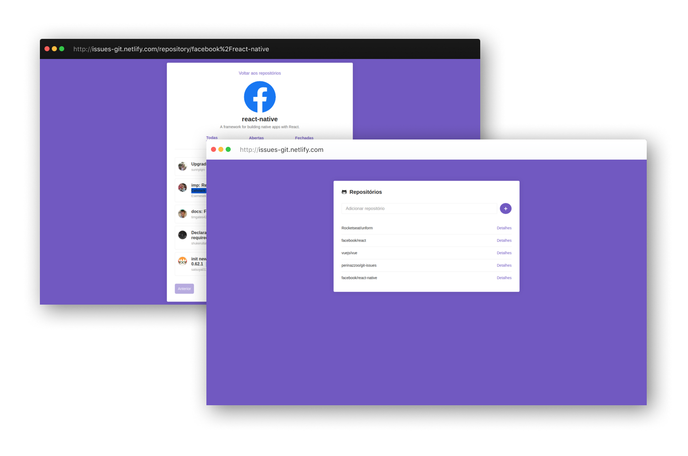

<h1 align="center">
Git Issues
</h1>
<blockquote align="center">
:octocat: App desenvolvido em React para salvar repositórios do Github e checar as issues do mesmo.
</blockquote>
 

## :thinking: Sobre o projeto

Este é um App onde você pode adicionar repositórios para checar, de forma rápida, suas issues, podendo filtrar por `Todas`, `Abertas` e `Fechadas`.

Foi consumida a API disponibilizada pelo Github para tal.

Você pode testar essa aplicação em https://issues-git.netlify.com

## :computer: Tecnologias utilizadas

* <a target="_blank" href="https://github.com/facebook/react">React</a>
* <a target="_blank" href="https://styled-components.com/">Styled Components</a>
* <a target="_blank" href="https://github.com/axios/axios">Axios</a>
* <a target="_blank" href="https://github.com/eslint/eslint">ESLint</a>
* <a target="_blank" href="https://github.com/facebook/prop-types">Prop-types</a>

## :wrench: Iniciando o projeto

1. Clone este repositório usando: `git clone https://github.com/perinazzoo/git-starred.git`;
2. Vá para o diretório usando: `cd git-starred`;
3. Rode o comando `yarn` para instalar todas as dependências;
4. Rode o comando `yarn start` para iniciar o servidor;

 
<blockquote>Feito com :coffee: e :heart: por Gabriel Perinazzo</blockquote>
